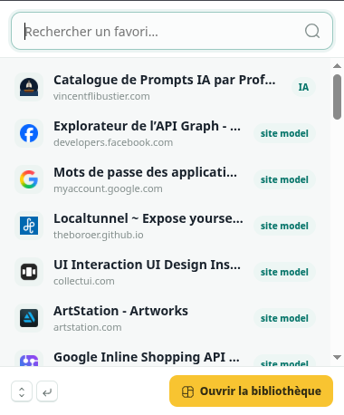
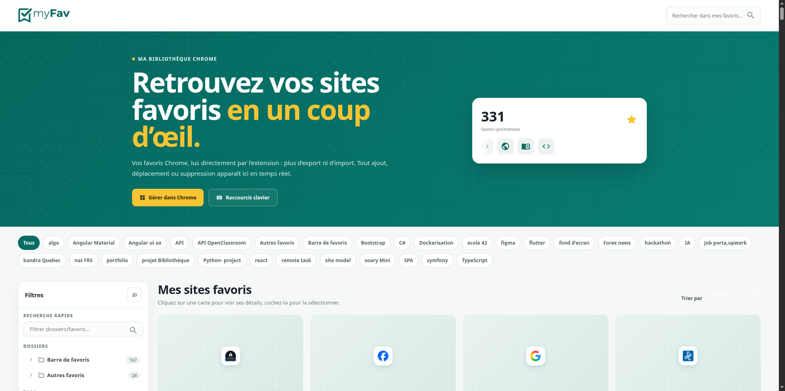

# MyFav — Mes favoris Chrome

Extension Chrome qui affiche vos favoris sous forme de bibliothèque visuelle, avec recherche, navigation par dossiers, tags, et actions massives.

## Fonctionnalités

- Bibliothèque visuelle de cartes avec aperçus des sites (optionnel)
- Sidebar gauche avec :
  - Recherche rapide dans les dossiers/favoris
  - Arbre hiérarchique des dossiers Chrome
  - Création, sélection et suppression de tags
  - Liste des favoris du dossier sélectionné
- Filtres : Catégories (chips), Tri (date, nom, dossier)
- Actions massives : déplacer, supprimer, ouvrir plusieurs favoris
- Panneau de détails avec navigation clavier (flèches), copie, modification, tags
- Compteur animé + carousel d’icônes dans le hero
- Synchronisation en temps réel des favoris Chrome

## Installation

### Depuis le dossier local

1. Ouvrez Chrome
2. Allez dans `chrome://extensions`
3. Activez le **mode développeur** (bouton en haut à droite)
4. Cliquez sur **Charger l’extension non packagée**
5. Sélectionnez le dossier `myfav-extension`

### Depuis le store Chrome (à venir)

Une version publiée sur le Chrome Web Store sera disponible prochainement.

## Développement

### Fichiers principaux

| Fichier | Rôle |
|---------|------|
| `manifest.json` | Configuration de l’extension (permissions, icônes, raccourcis) |
| `myfav.html` | Structure de la page principale |
| `myfav.css` | Styles |
| `myfav.js` | Logique de l’interface |
| `shared/data.js` | Accès aux favoris Chrome (lecture/écriture) |
| `shared/tags.js` | Gestion des tags (stockage local) |
| `shared/ui.js` | Icônes MynaUI, helpers |
| `shared/icons-data.js` | Données SVG des icônes |
| `shared/meta.js` | Aperçus des sites (meta tags) |
| `popup.html` / `popup.js` | Popup rapide |
| `background.js` | Service worker (mot-clé `fav` dans l’omnibox) |

### Structure des tags

Les tags sont stockés dans `chrome.storage.local` sous deux clés :
- `bookmarkTags` : `{ bookmarkId: [tag1, tag2, ...] }`
- `allTags` : `[tag1, tag2, ...]` (liste globale)

## Licence

Apache-2.0 (icônes MynaUI)

## Captures d'écran

